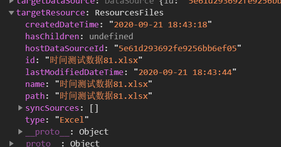
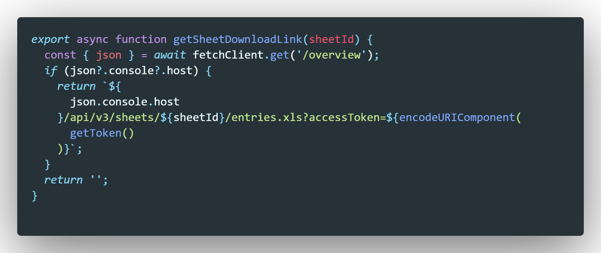
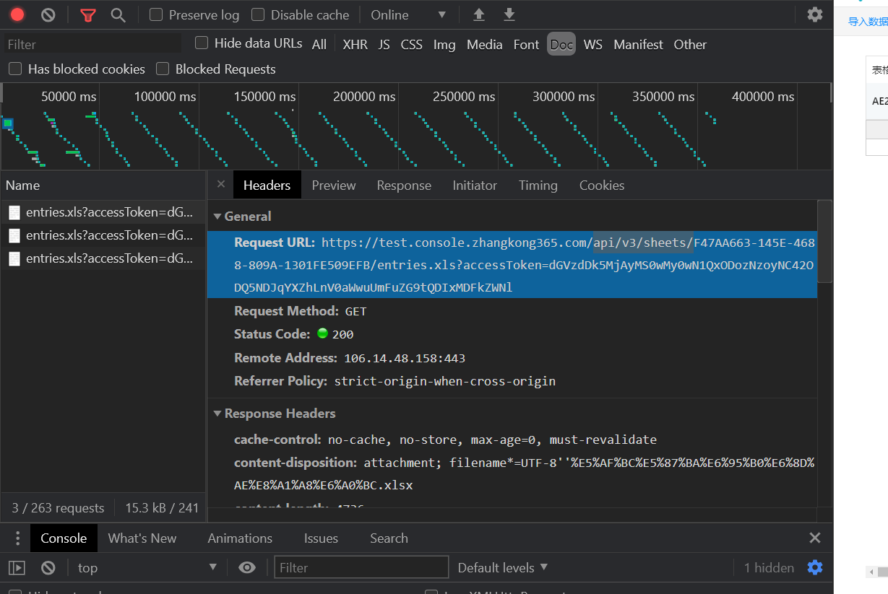
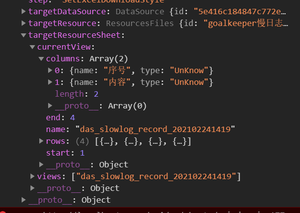

```
    const uploadingMenu=(
      <Menu>
        <Menu.Item>
        <span
              className="btn-link"
              style={style}
              onClick={() => {
                this.handleMenuClick('import');
              }}
            >
              导出Excel
            </span>
        </Menu.Item>
        <Menu.Item>
        <span
              className="btn-link"
              style={style}
              onClick={() => {
                this.handleMenuClick('import');
              }}
            >
              导出Excel报表
            </span>
        </Menu.Item>
      </Menu>
    )


<Dropdown overlay={uploadingMenu}  trigger={['click']} icon={null}>
               <a className="ant-dropdown-link" onClick={e => e.preventDefault()}>
                    导入数据<Icon type="down" />
              </a>
           </Dropdown>
```

# 同步外部表格

```js
case 'sync': {
        this.setState({ currentMenu: 'sync', modalVisible: true });
        this.props.fetchDataSources({});
        break;
      }
```

1. 



targetResource






```
能设法提供一个获取数据源表格的工作列表（sheet）的API吗，因为现有窘境：之前的导入能查看并选择工作表是在本地能获取excel具体file的基础之上，但是数据源的Excel提供的相应获取file的API只有我现在需要实现的这个，但需要sheet作为body，这导致了无法实现 
```

## 总结

1. **严谨：XXXX==undefined换成!undifined,考虑{}**
2. api有问题要及时和后端接触
3. if对对象的判断常常使用length
4. if判断对象类型是否为{}常常用到Object.keys(obj).length>0
5. 新的组件构型（通过定义const step）
6. rebase替代merge 



[{},{}]

1.之前的导出

dataItemId: "采集数据核对结果.xlsx"

datasourceId: "5e3cc02a2842fa2e8f5c2c24"

resource:

resourceId: "F47AA663-145E-4688-809A-1301FE509EFB"
resourceType: "Sheet"
sheetName: "sulfonation磺化"

sourceType: "DataSource"