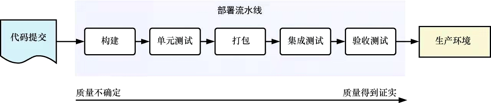

### 1.3微服务开发生命周期

三大迭代阶段：设计，部署和监控

1. 微服务设计

   - 单体应用是否可行
   - 服务的范围划分
   - 通信：服务之间的通信可以是异步的，也可以是同步的。虽然同步系统更易于进行问题的排查，但是异步系统的解耦性更高
   - 可恢复性

2. 微服务部署

   - 微服务部署的人为操作标准化

     docker

   - 实现持续交付流水线

     

3. 服务监控

   - 发现潜在的薄弱环节并进行重构
   - 了解数以百计的服务的行为