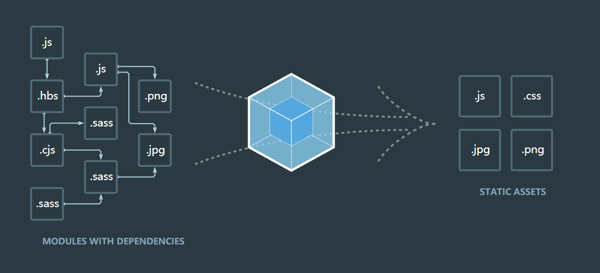

# 第一章react入门

## 1.1开始之前

### 1.1.1下载node和NPM

```bash
node -v
v10.16.3
```

- npm是node的包管理工具，npm:node package manager
- `npm install <package_name>`

- 使用淘宝镜像

```bash
npm install -g cnpm --registry=https://regitry.npm.taobao.org
cnpm install <package_name>
```

### 1.1.2模块打包工具Browserify

- 基于种种原因，引出了两款较为流行的模块打包工具Browserify和Webpack
- [Browserify](http://browserify.org/)


<h1><center><a href="https://github.com/browserify/browserify#usage">doc</a></center></h1>

**使用类似node的require（）方法加载模块，在html代码中使用script标签引用browserify编译后的文件**

[browserify实践](https://www.jianshu.com/p/8d8b8752d8a0)

[代码](./1.1.2_browserify)

总结：browserify能让本地分js 应用服务端的js，让js直接具有了require的能力

使用步骤：

1. 写node程序或者代码模块
2. 用browserify预编译成bundle.js
3. 在html中引入bundle.js

### 1.1.3模块打包工具Webpack

**本示例代码最常用的打包工具**


类似的打包工具还有[Rollup](https://www.rollupjs.com/)和[parceljs](https://www.parceljs.cn/)



**如上述，webpack根据模块的依赖关系递归地构建一个依赖关系图，当中包含了一个应用程序包含的所有模块**

####  0.全局安装

```shell
npm install -g webpack webpack-cli
```

*注：webpack和webpack-cli在Webpack4中被分离*

webpack中四个核心概念：entry(入口)output(输出)loader(转换器)pluggins(插件)

#### 1.entry(入口)

entry指引webpack从哪个模块开始，是构建的入口，之后webpack自动找出应用内其他相互依赖的内容进行打包

配置示例：

```js
module.exports={
entry:'./src/file.js'
}
```

#### 2.output(出口)

ouput告诉webpack所构建的bundle在哪里输出，默认路径是"./dist"

配置示例

```js
const path=require('path');
module.exports={
entry:"./src/file.js",
output:{
	path:path.resolve(_dirname,'dist'),
    filename:'bundle.js'
}
};
```

通过output.path和output.filename属性定义webpack导报后bundle的路径和名称

#### 3.loader(转换器)

loader用于配置webpack处理一些非js文件，因为Webpack本身只能理解JavaScript，通过loader可以实现import 导入的任何类型模块(如jsx,less,css等)

配置示例

```js
const path=require('path');
module.exports={
	entry:"./src/file.js",
	output:{
		path:path.resolve(_dirname,'dist'),
    	filename:'bundle.js'
	},
	module:{
		rules:[
			{test:/\.less$/,use:'less-loader'}
				]
		}
};
```

loader的test属性告诉webpack需要处理的“对象”，use属性告诉Webpack用什么去处理

#### 4.Plugins(插件)

用于打包优化和压缩等，非常强大

配置示例

```js
const HtmlWebpackPlugin = require('html-webpack-plugin');//通过npm安装

const webpack=require('webpack');						//用于访问内部插件

module.exports={
	module:{
		rules:[
			{test:/\.less$/,use:'less-loader'}
				]
		}
	plugins:[
	new webpack.optimize.UglifyJsPlugin(),
	new HtmlWebpackPlugin({template:'./src/index.html'})
	]
};
```

在真实项目中区分开发环境和生产环境，可以通过mode参数配置

```js
module.exports={
mode:'production'
}
```

### 1.1.4Webpack构建实战

