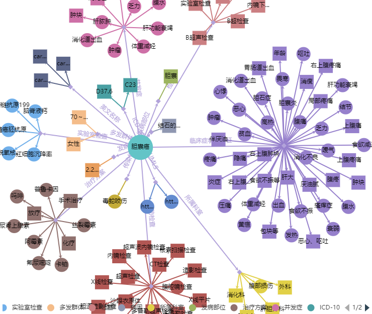
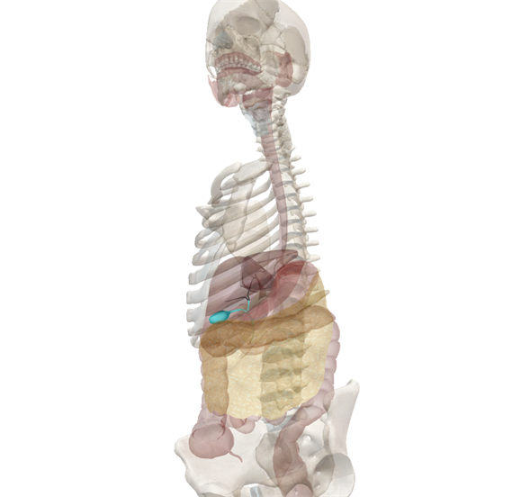
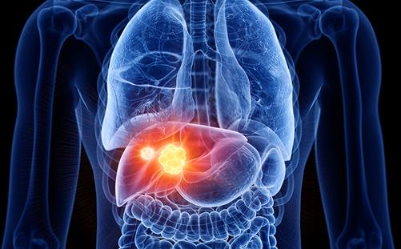
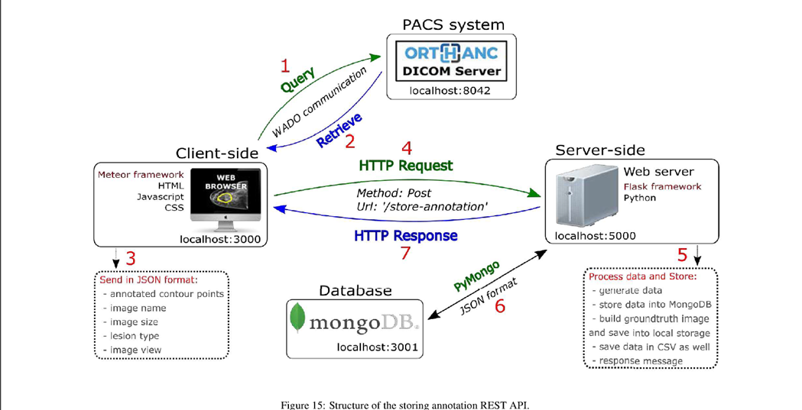
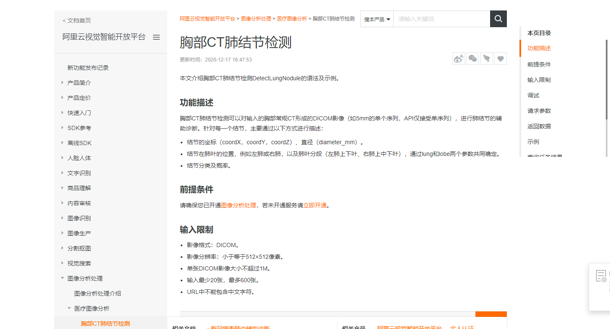
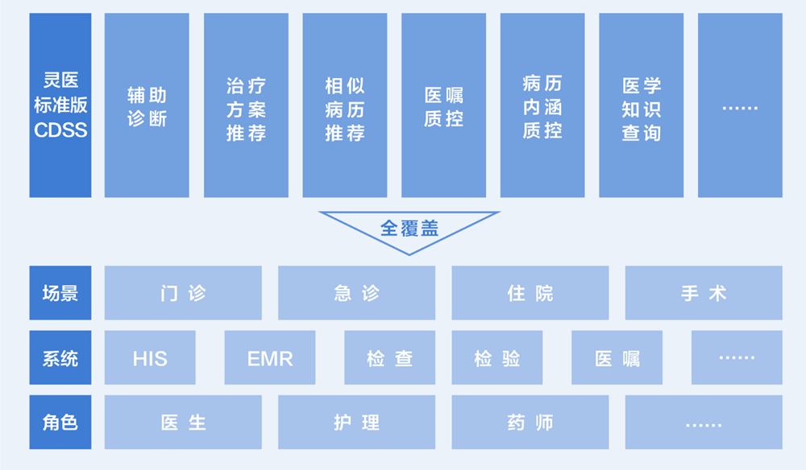
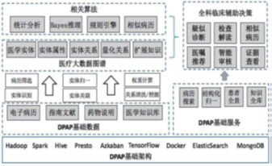
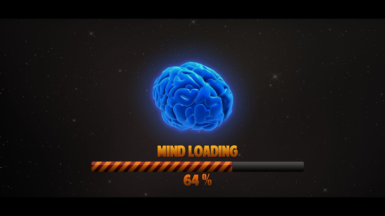
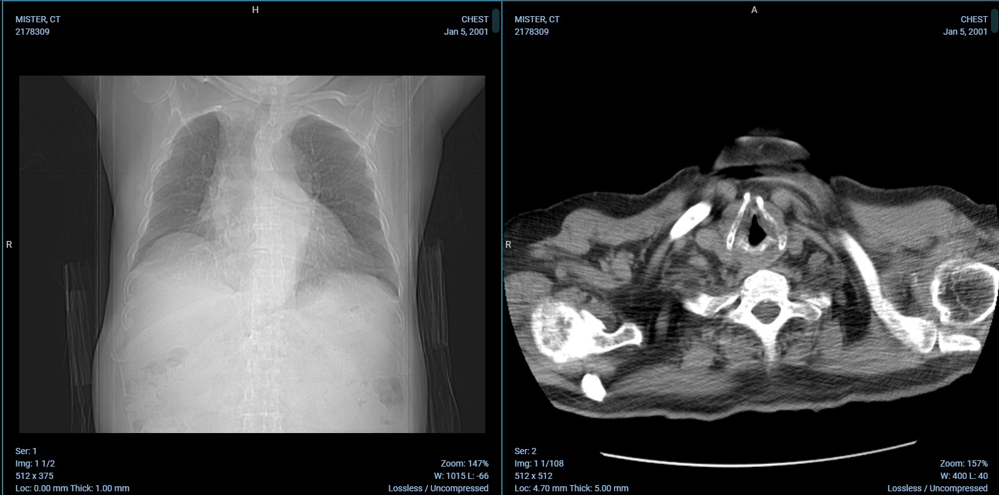

# ppt背板

# [page1]

#### 胆囊癌

胆管癌发病率很低，大家很少能碰上胆管癌的患者，所以平时很少引起大家的注意，有些人可能都没有听到过这个名字，或者常常和胆囊癌、肝癌混为一谈。但是这种肿瘤恶性度非常高，愈后不好，治疗效果不佳，严重的影响患者生活质量。如果能够实现快速诊断，早期治疗，对维护医生的工作以及病人的健康很有意义

[中文医学知识图谱](https://zstp.pcl.ac.cn:8002/mekg?v0=%E8%83%86%E5%9B%8A%E7%99%8C)(忽略)

# [page2]

胆囊，位于右方肋骨下肝脏后方的梨形囊袋构造（肝的胆囊窝内），有浓缩和储存[胆汁](https://baike.baidu.com/item/胆汁)之作用：

- 一个饥饿的人（即非消化期间），胆汁储存在胆囊内，当消化需要的时候，再由胆囊排出，所以胆囊被称为“胆汁仓库”。同时又起到缓冲[胆道](https://baike.baidu.com/item/胆道)压力的作用。
- 金黄色碱性肝胆汁中的大部分水和电解质，由胆囊黏膜吸收返回到血液，留下胆汁中有效成分储存在胆囊内，变成棕黄色或墨绿色呈弱酸性的胆囊胆汁。

# [page3]

胆囊癌早期无特异性[临床表现](http://www.a-hospital.com/w/临床表现)或只有[慢性胆囊炎](http://www.a-hospital.com/w/慢性胆囊炎)的症状，早期诊断很有困难，一旦出现上[腹部](http://www.a-hospital.com/w/腹部)[持续性疼痛](http://www.a-hospital.com/w/持续性疼痛)包块[黄疸](http://www.a-hospital.com/w/黄疸)等病变已到晚期，其各种检查亦出现异常。

# [page4]

**构建胆囊癌辅助决策系统的初衷之一便是胆囊癌早期不易诊断**，在系统的加持下，医生诊断流程简化

# [page5]

#### 胆囊癌辅助决策系统是在已有的成功训练模型的算法之上构建一个使医生`沉浸式`诊断甚至帮助医生诊断胆囊癌的在线平台

以促进胆囊癌也不只是胆囊癌的早发现和早治疗

# [page6]

国内类似的解决方案也有（当然只是类似）

比如像阿里健康的肺结节智能检测（附https://help.aliyun.com/document_detail/172097.html）或是膝关节X光KL分级（https://help.aliyun.com/document_detail/179241.html?spm=a2c4g.11186623.6.781.218d4be53V3DWA）

​																				（已经形成了完备的解决方案和开发文档）

# [page7]

百度的灵医智惠系统,这个例子只是cdss，基于本地部署，而什么是cdss

# [page8]

#### 胆囊癌的智能诊断是临床决策支持系统的其中一个环节，临床支持决策即通常所谓的CDSS系统

# [page9]

借助医疗知识图谱，根据患者症状描述及化验数据，给出智能诊断、治疗方案推荐及转诊指南，所谓的**诊前决策、诊中决策和诊后决策**三大应用场景

**CDSS把医学观察所见和现有的医学知识联系起来，去影响医生的诊疗决策**。

CDSS这一层就跟知识图谱j紧密联系在一起了

# [page10]

将胆囊癌的**智能诊断**应用于辅助标记系统，同时实现**实时追踪**（同一个病人不同时间同一个位置的）以及基于[vtk](https://kitware.github.io/vtk-js/index.html)的**三维显示**

这是本项目的关注重点，也是创新点

与医生实际沟通后，发现实现本系统的基本功能，即简单的标注业务，并不难

# [page11]

实现上述创新点将对我个人，以及团队的成员带来不少的新认识

以上

