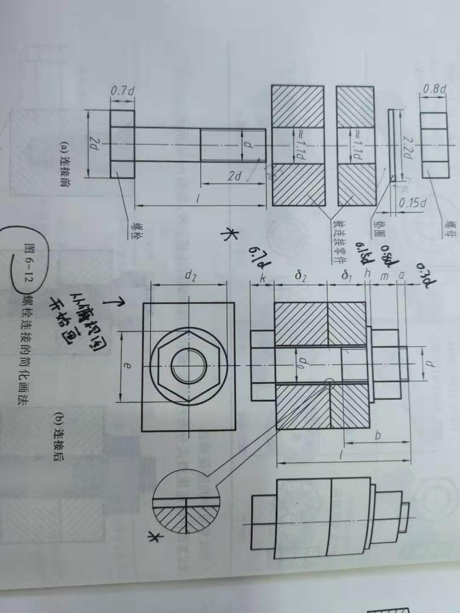
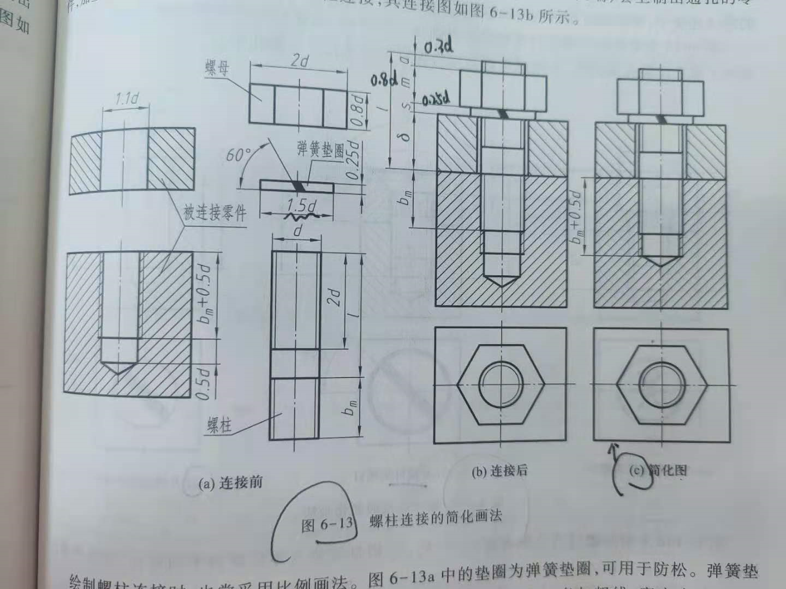
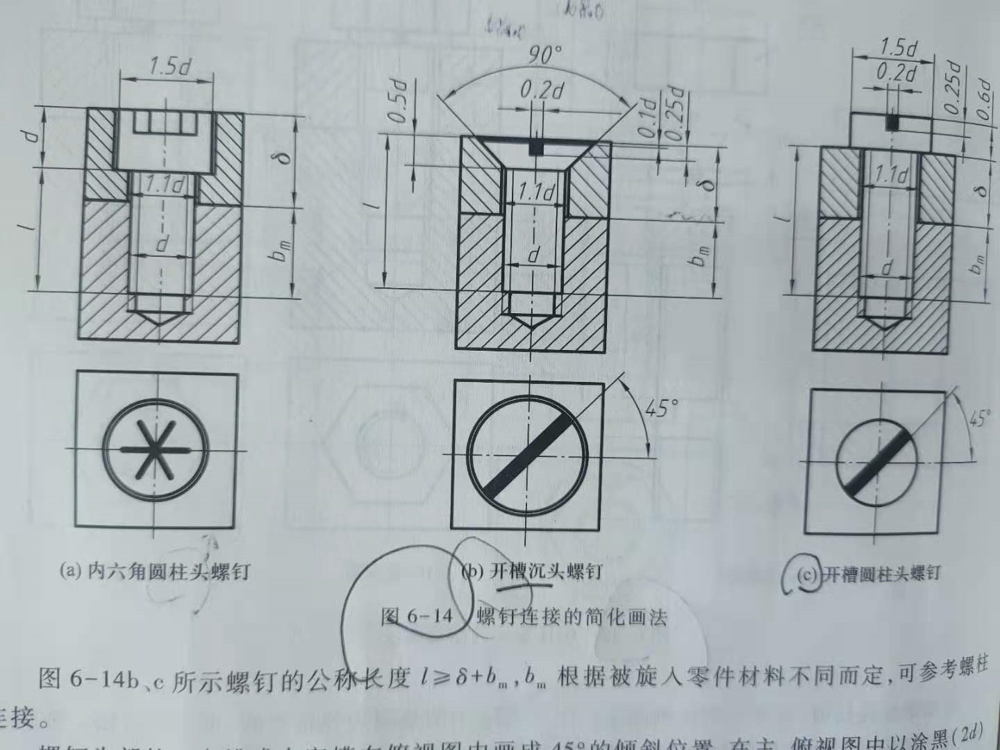
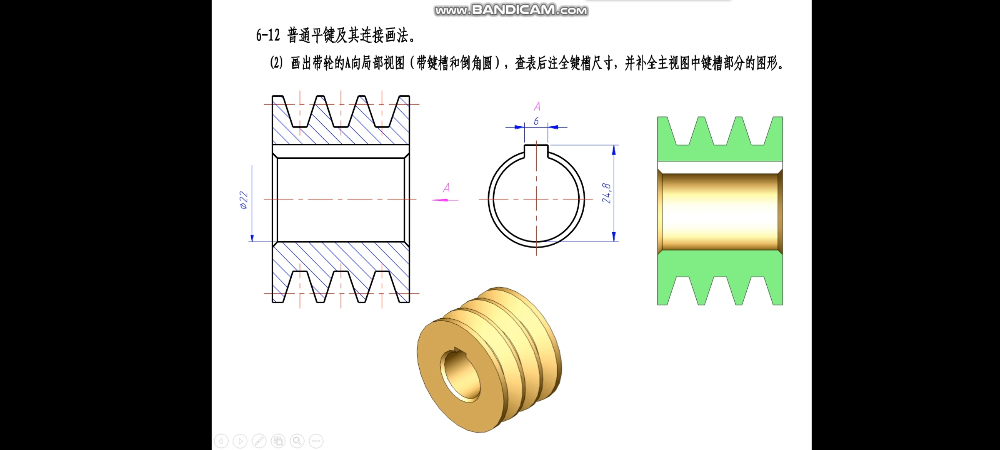
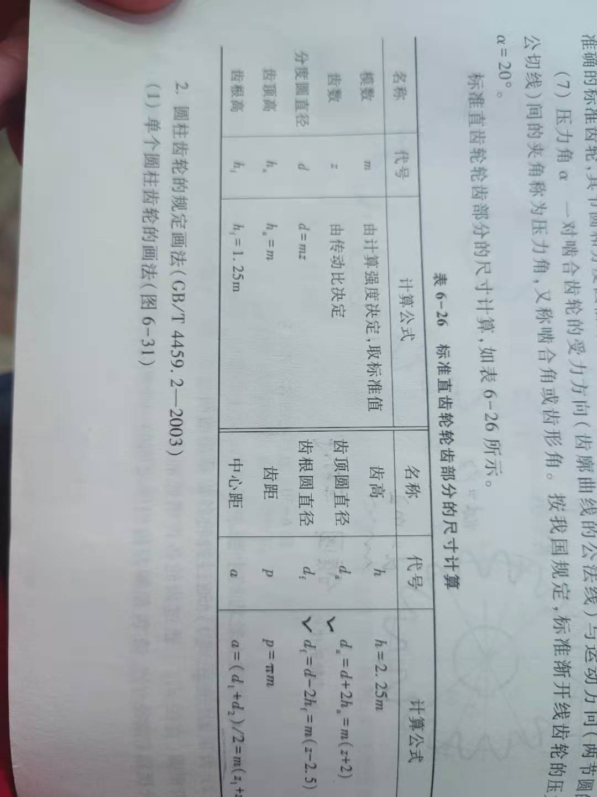
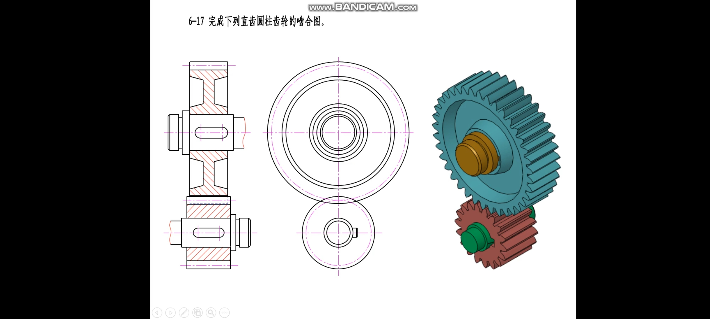
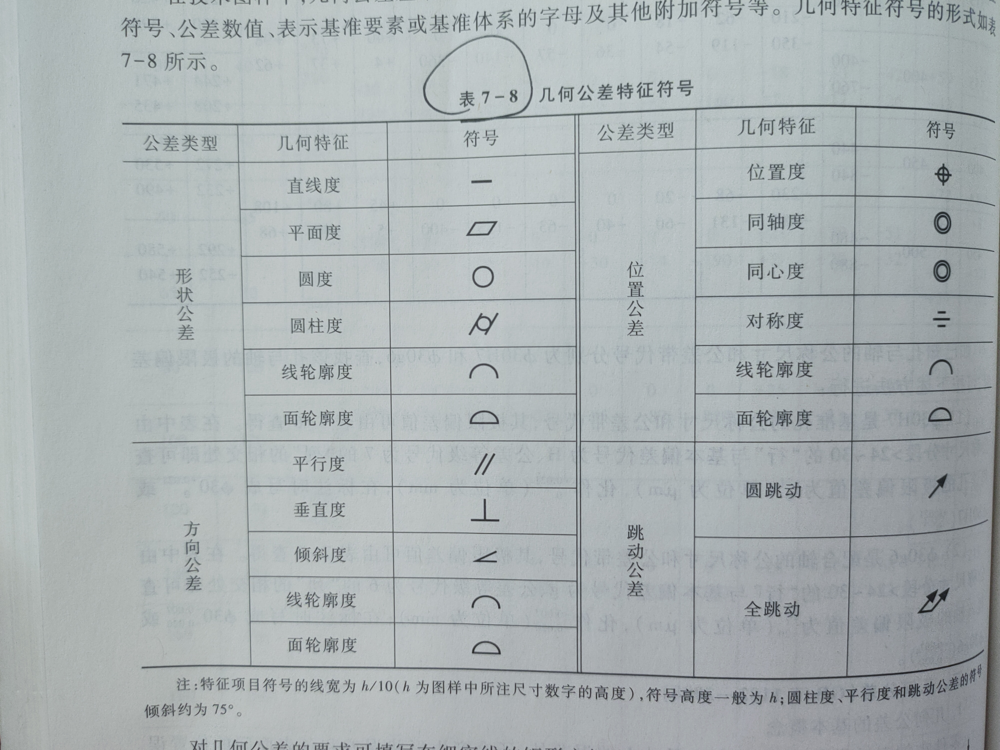

#### 螺纹标注

|      标记      |     螺纹种类      | 大径     | 螺距       | 导程      | 线数 | 旋向     | 公差带代号 |
| :------------: | :---------------: | -------- | ---------- | --------- | ---- | -------- | ---------- |
|     M20-6h     |   粗牙普通螺纹    | 20       | 2.5        | 2.5       | 1    | 右       | 中径顶径6h |
|   B32×6LH-7e   |    锯齿形螺纹     | 32       | 6          | 6         | 1    | 左       | 中径7e     |
| Tr40×14(P7)-8H |     梯形螺纹      | 40       | 7          | 14        | 2    | 右       | 中径8H     |
|      标记      |     螺纹种类      | 尺寸代号 | 大径       | 螺距      | 旋向 | 公差等级 |            |
|      G1A       |  55°非密封管螺纹  | 1        | ~~33.249~~ | ~~2.309~~ | 右   | A        |            |
|    G3/4B-LH    | 55°非密封福安螺纹 | 3/4      |            |           | 左   | B        |            |
|     R21/2      | 55°密封圆锥外螺纹 | 1/2      | ~~20.955~~ | ~~1.814~~ | 右   |          |            |
|     Rc1-LH     |   55°圆锥内螺纹   | 1        |            |           | 左   |          |            |
|      Rp2       |   55°圆柱内螺纹   |          |            |           |      |          |            |

注：

- 中径顶径均为6g或6H时，可以不标注

#### 螺纹紧固件

###### 螺栓连接

###### 螺柱连接

注：

- 垫圈开槽左旋60°：1.5d×0.25d
- 螺母（主视图）高0.8d

###### 螺钉连接

#### 键

**注意尺寸标注**

#### 齿轮

###### 公式

- ~~齿顶高ha=m~~
- 模数m=d/z
- d为分度圆直径z为齿数
- 齿顶圆直径da=m(z+2)
- 齿底园直径df=m(z-2.5)

###### 啮合画法

注：

- 不画齿根圆
- 点画线更加靠近齿顶

#### 零件图

###### 四大类零件

1. 轴
2. 轮盘盖
3. 箱体类
4. 叉架

###### 几何公差

