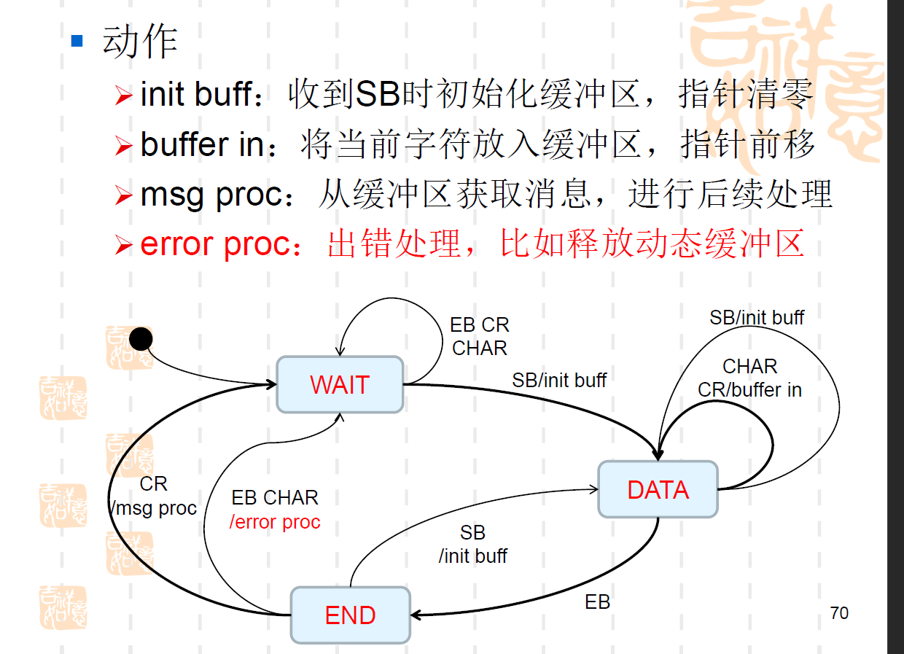

-  电子病历应用水平分级

  0：未形成

  1：初步数据采集

  2：部门内数据交换

  3：部门间数据交换，初级医疗决策支持

  4：全院信息共享，中级

  5：统一数据管理，各部门系统数据集成，基本建立以电子病历为基础的医院信息平台

  6：全流程医疗数据闭环管理，高级医疗决策支持

  7：区域共享医疗，完整电子病历系统

- HL7消息的组成

  段，字段，组件，子组件

- 编码规则

  `|AAA^XXX~YYY&ZZZ^BBB|`

  段终止符<CR>  ASCII码0X0D

  字段分隔符|

  字段重复分隔符~

  组件分隔符^

  子组件分隔符&

- 段的可选性与可重复性

  []可选

  {}可重复

- 字段的可选性与可重复性

  可选性

  R：必须的

  O：可选的

  C：某些条件下触发

  X：不触发

  B：与老版本兼容而保留的

  可重复性

  N或空白：不可

  Y：可

  数字（整数）：重复次数	

- MLLP协议规定，起到的作用

  - ＜ＳＢ＞块开始标志DATA数据＜ＥＢ＞块结束标志＜ＣＲ＞回车符
  - 作用：相当于在会话层封装协议，在TCP/IP之上标识HL７的边界

- HL7消息确认模式的种类，具体如何设置

  - 确认原始模式和确认增强模式

  - 确认增强模式：系统发出的消息中具有MSH-15和16

    确认原始模式：MSH-15：NE；MSH-16：AL

- 组合模式设置HL７消息处理类

  组合模式：抽象构件，叶子构件，容器构件

  抽象构件：抽象的字段和方法

  叶子构件：简单类型字段，组件，子组件

  容器构件：消息，段，复合类型字段，组件，子组件

- 状态模式以及如何用状态模式设计MLLP处理类

  - 将对象的状态从对象中分离出来，封装到专门的状态类中，，使得对象状态可以灵活变化，客户端则无需关心对象状态的转换以及对象当前所处的状态，对于处于任意状态的对象，客户端做一致处理，设计环境类，抽象状态类和具体状态类

  

- MD校验运算法则

  