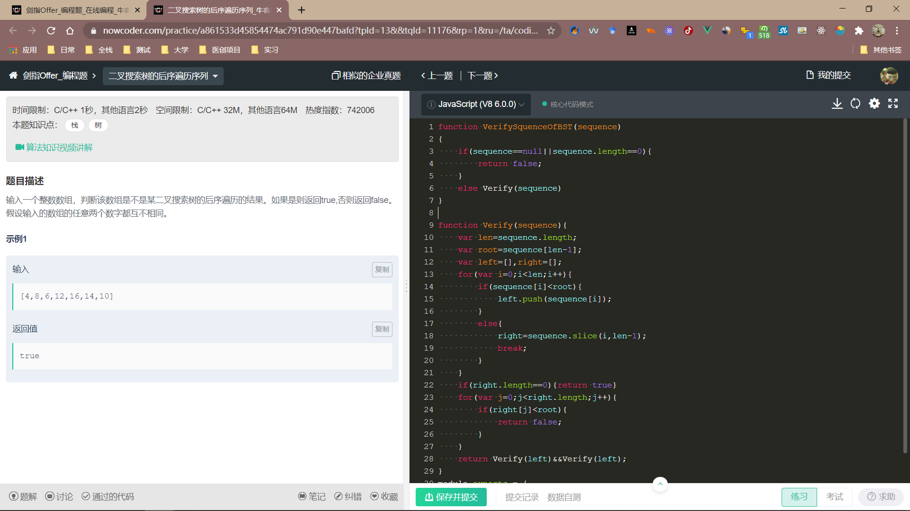

### 二叉搜索树

1. 算法时间复杂度

   ```javascript
   /*
   最坏的时间复杂度为O(n);
   优化的二叉搜索树：红黑树，AVL树--->>O(logn);
   支持动态查询
   */
   ```

2. 基本思想

```javascript
/*
二叉查找树是先对待查找的数据进行生成树，确保树的左分支的值小于右分支的值，然后在就行和每个节点的父节点比较大小，查找最适合的范围。 这个算法的查找效率很高，但是如果使用这种查找方法要首先创建树。
*/
```



输入一个整数数组，判断该数组是不是某二叉搜索树的后序遍历的结果。如果是则返回true,否则返回false。假设输入的数组的任意两个数字都互不相同。

```js
function VerifySquenceOfBST(sequence)
{
    // write code here
    if(sequence == null || sequence.length == 0){
        return false
    }
    return Verify(sequence)
}
function Verify(sequence){
    var root = sequence[sequence.length - 1];
    //后序遍历根节点为数组的最后一个元素
    var left = [], right = [];
    
    
    for(var i = 0; i <sequence.length; i++){
        if(sequence[i] < root){
            left.push(sequence[i])
        }else{
            right = sequence.slice(i,sequence.length - 1);
            break;
        }
    }
    if(right.length == 0){ return true }
    for(var j = 0; j < right.length; j++){
        if(right[j] < root){ 
            return false;
        }
    }
        return Verify(left)&&Verify(right)
 }
module.exports = {
    VerifySquenceOfBST : VerifySquenceOfBST
};
```

