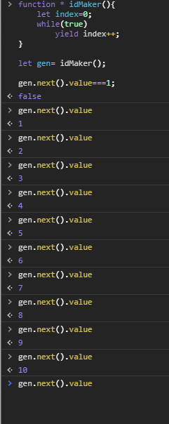

```js
function * gen(){
yield 1;
yield 2;
yield 3;
}

let g=gen();

```

例如一个无限迭代器

```js
function * idMaker(){
    let index=0;
    while(true)
        yield index++;
}

let gen= idMaker();

gen.next().value===1;

```

